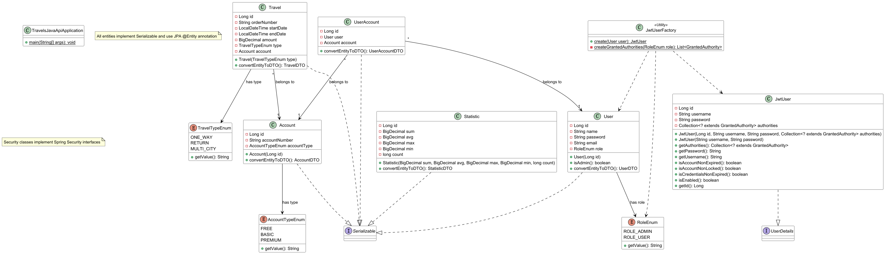
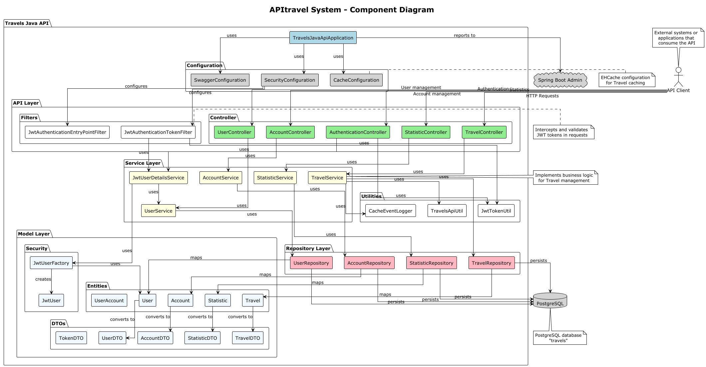
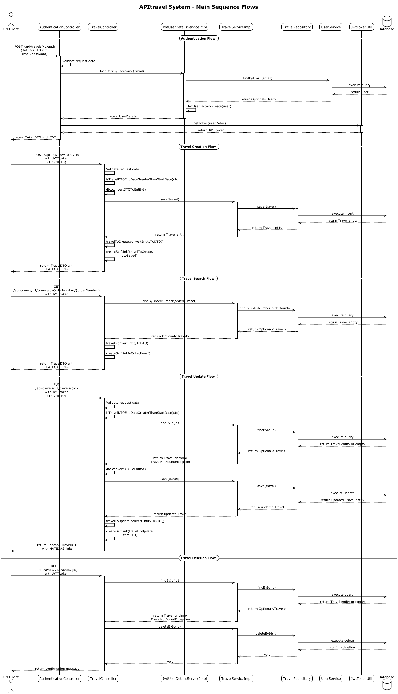

# APIトラベルプロジェクトの分析と自動生成図表の解説

## 1. プロジェクト概要
重要: 本ドキュメントに含まれるすべての分析、図表解説、テストケース解析、および技術的考察は、最新のAI技術を活用して自動生成されています。コードベースの高度な解析から各種UML図の解釈、テスト戦略の策定まで、AIによる自動処理で作成されています。これにより、人間による手動分析と比較して、効率的かつ包括的なプロジェクト理解を提供しています。
project source code 
https://github.com/mariazevedo88/travels-java-api
APIトラベルは、旅行予約と管理のためのRESTful APIを提供するJavaベースのマイクロサービスです。このシステムは、ユーザー管理、アカウント管理、旅行予約の作成と管理などの機能を備えており、Spring Bootフレームワークを使用して実装されています。

システムはJWT（JSON Web Token）による認証を採用し、セキュアなAPIアクセスを提供しています。また、HATEOASを使用してRESTful APIのナビゲーションを容易にしています。

## 2. 自動生成された図表の解説

### 2.1 クラス図（ClassDiagram.puml）

クラス図はシステムの静的構造を表すもので、主要なエンティティクラス、そのプロパティ、メソッド、および各クラス間の関係を示しています。

#### 主要なエンティティクラス:

1. **Account**: ユーザーの金融口座情報を表すクラス
   - 属性: id, accountNumber, accountType
   - タイプはAccountTypeEnum（FREE, BASIC, PREMIUM）で定義

2. **Travel**: 旅行予約に関する情報を表すクラス
   - 属性: id, orderNumber, startDate, endDate, amount, type, account
   - タイプはTravelTypeEnum（ONE_WAY, RETURN, MULTI_CITY）で定義

3. **User**: システムのユーザー情報を表すクラス
   - 属性: id, name, password, email, role
   - ロールはRoleEnum（ROLE_ADMIN, ROLE_USER）で定義

4. **UserAccount**: ユーザーと口座の関連付けを表すクラス
   - 属性: id, user, account

5. **Statistic**: 旅行データの統計情報を表すクラス
   - 属性: id, sum, avg, max, min, count

#### セキュリティ関連クラス:

1. **JwtUser**: Spring Securityの認証に使用されるユーザー情報を表すクラス
   - UserDetailsインターフェースを実装

2. **JwtUserFactory**: UserエンティティからJwtUserオブジェクトを作成するユーティリティクラス

#### 重要な関連性:

- Travel は Account に属する (多対1の関係)
- UserAccount は User と Account を関連付ける (多対1の関係)
- すべてのエンティティはSerializableインターフェースを実装
- JwtUserはSpring SecurityのUserDetailsインターフェースを実装

### 2.2 コンポーネント図（ComponentDiagram.puml）

コンポーネント図はシステムの論理的な構造を表し、各コンポーネントとその相互作用を示しています。

#### 主要なコンポーネント:

1. **APIレイヤー**:
   - コントローラー（TravelController, AccountController, UserController, StatisticController, AuthenticationController）
   - フィルター（JwtAuthenticationTokenFilter, JwtAuthenticationEntryPointFilter）

2. **サービスレイヤー**:
   - TravelService, AccountService, UserService, StatisticService, JwtUserDetailsService

3. **リポジトリレイヤー**:
   - TravelRepository, AccountRepository, UserRepository, StatisticRepository

4. **モデルレイヤー**:
   - エンティティ（Travel, Account, User, Statistic, UserAccount）
   - セキュリティ（JwtUser, JwtUserFactory）
   - DTOクラス（TravelDTO, AccountDTO, UserDTO, StatisticDTO, TokenDTO）

5. **ユーティリティ**:
   - TravelsApiUtil, JwtTokenUtil, CacheEventLogger

6. **設定**:
   - SecurityConfiguration, SwaggerConfiguration, CacheConfiguration

#### 外部コンポーネント:

- **PostgreSQLデータベース**: データの永続化
- **Spring Boot Admin**: アプリケーションのモニタリング
- **APIクライアント**: 外部システムからのアクセス

#### 重要な関連性:

- コントローラーはサービスを使用
- サービスはリポジトリを使用
- リポジトリはエンティティをマッピング
- エンティティはDTOに変換される
- すべてのデータはPostgreSQLに保存される
- セキュリティフィルターはJWTトークンを検証

### 2.3 シーケンス図（SequenceDiagram.puml）

シーケンス図はシステム内の主要なユースケースに対する動的な相互作用フローを表しています。

#### 主要なシーケンスフロー:

1. **認証フロー**:
   - クライアントは認証コントローラーにユーザー認証情報を送信
   - UserDetailsServiceがユーザーを検証
   - 認証成功後、JWTトークンが生成されて返却

2. **旅行作成フロー**:
   - クライアントはJWTトークンとともに旅行データを送信
   - トークンが検証され、リクエストデータが検証される
   - 旅行エンティティが作成され、データベースに保存
   - 作成された旅行のDTOとHATEOASリンクが返却

3. **旅行検索フロー**:
   - クライアントは注文番号などで旅行を検索
   - 対応する旅行エンティティがデータベースから取得
   - 旅行DTOとHATEOASリンクが返却

4. **旅行更新フロー**:
   - クライアントは更新データとともに旅行IDを送信
   - 既存の旅行が検証され、更新される
   - 更新された旅行のDTOとHATEOASリンクが返却

5. **旅行削除フロー**:
   - クライアントは削除する旅行のIDを送信
   - 旅行の存在が確認され、削除される
   - 確認メッセージが返却

## 3. テストケース一覧

プロジェクトには以下の統合テスト（ITB）テストケースが含まれています。

### シナリオ1: 基本的なユーザー、口座、旅行フロー

- **テストケース1.1**: 新規ユーザー登録と認証
- **テストケース1.2**: 口座の作成
- **テストケース1.3**: ユーザーと口座の関連付け
- **テストケース1.4**: 旅行の作成
- **テストケース1.5**: 特定期間の旅行の検索

### シナリオ2: エラーケースと例外処理

- **テストケース2.1**: 無効なユーザー認証
- **テストケース2.2**: 無効な旅行データ
- **テストケース2.3**: 存在しない旅行の検索

### シナリオ3: 旅行の更新と削除

- **テストケース3.1**: 旅行の更新
- **テストケース3.2**: 旅行の削除

### シナリオ4: セキュリティとアクセス制御

- **テストケース4.1**: トークンなしでのアクセス
- **テストケース4.2**: 有効期限切れトークンでのアクセス
- **テストケース4.3**: 無効なAPIキーでのアクセス

### シナリオ5: 統計機能のテスト

- **テストケース5.1**: 旅行統計の取得

### シナリオ6: パフォーマンステスト

- **テストケース6.1**: 大量リクエスト時の応答性

## 4. 自動生成図表の作成方法

APIトラベルプロジェクトの図表は、PlantUMLツールを使用して自動生成されています。

### 4.1 PlantUMLの活用

PlantUMLは、テキストベースのUMLダイアグラム作成ツールで、次のような特徴があります：

- テキストファイル（.puml）から様々なUML図を生成
- バージョン管理システム（Git）と互換性がある
- コードからダイアグラムの自動生成が可能

### 4.2 各図表の自動生成プロセス

#### クラス図の生成:

1. モデルクラスの分析
2. クラス間の関係の抽出
3. クラス図用のPlantUMLコードの生成
4. .pumlファイルの生成と画像への変換

#### コンポーネント図の生成:

1. アプリケーション構造の分析
2. コンポーネント間の依存関係の抽出
3. コンポーネント図用のPlantUMLコードの生成
4. .pumlファイルの生成と画像への変換

#### シーケンス図の生成:

1. APIエンドポイントのフロー分析
2. シーケンス図用のPlantUMLコードの生成
3. .pumlファイルの生成と画像への変換

### 4.3 テストケースの自動生成

テストケースはAPIの仕様に基づいて自動生成され、Markdownドキュメントとして提供されています。各テストケースは以下の情報を含みます：

- テストの目的
- 前提条件
- テスト手順（リクエストの詳細を含む）
- 期待される結果
- 検証ポイント

## 5. 技術的考察

### 5.1 アーキテクチャの特徴

APIトラベルプロジェクトは、以下のようなアーキテクチャ特性を持っています：

1. **マルチレイヤーアーキテクチャ**:
   - コントローラー層（API層）
   - サービス層（ビジネスロジック）
   - リポジトリ層（データアクセス）
   - モデル層（エンティティとDTO）

2. **RESTful API設計**:
   - HTTPメソッド（GET, POST, PUT, DELETE）の適切な使用
   - リソースベースのエンドポイント
   - HAETOASによるリンク提供

3. **セキュリティ設計**:
   - JWTベースの認証
   - ロールベースのアクセス制御
   - APIキーによる追加認証

4. **キャッシング**:
   - EHCacheによるデータキャッシング
   - パフォーマンス最適化

### 5.2 使用されている技術スタック

1. **フレームワーク**:
   - Spring Boot
   - Spring Security
   - Spring Data JPA

2. **データベース**:
   - PostgreSQL

3. **ドキュメンテーション**:
   - Swagger/OpenAPI

4. **テスト**:
   - JUnit
   - Mockito

5. **デプロイメント**:
   - Maven
   - Procfile（Herokuデプロイメント用）

### 5.3 コード品質と保守性

1. **コード構造**:
   - 整理されたパッケージ構造
   - 明確な責任分担（単一責任原則）
   - インターフェースとその実装の分離

2. **保守性**:
   - テストカバレッジ
   - 詳細なドキュメンテーション
   - UML図による視覚的な理解サポート

3. **拡張性**:
   - モジュール化されたデザイン
   - コンポーネント間の低結合性
   - DTOパターンの採用

## 6. まとめ

APIトラベルプロジェクトは、旅行管理のための堅牢なRESTful APIを提供するJavaマイクロサービスです。AIでソースコードを自動分析し生成された図表（クラス図、コンポーネント図、シーケンス図）を通じて、システムの静的構造と動的な相互作用を明確に把握することができます。

このシステムは、セキュリティ、パフォーマンス、スケーラビリティを考慮した設計となっており、RESTfulベストプラクティスに従っています。また、自動化されたテストケースにより、システムの品質と信頼性を確保しています。
